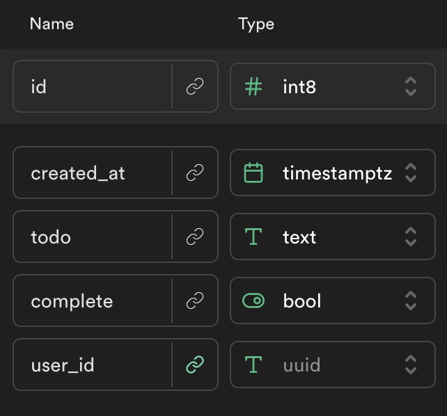

# Supabase Todo App

## Live Example:

https://alchemycodelab.github.io/web-01-todo-supabase/

## Getting Started

Use [this template](https://github.com/alchemycodelab/half-baked-web-01-todo-supabase) to get started.

## Learning Objectives

-   Perform CRUD actions on user data in supabase

## Description

Here is the schema for the `todos` table:

You will be creating a to do list using Supabase. Users should only be able to perform operations on todos associated with their user. You will be using an existing supabase database for this deliverable. Authentication has already been provided for you.

## Acceptance Criteria

-   Users should be able to add a to do item to their list (CREATE)
-   Users should be able to view all of their todos (READ)
-   Users should be able to "complete" items on their to do list (UPDATE)
-   Users should be able to delete all of their todos (DELETE)

## Rubric

The following is required for your assignment to be graded:

-   PR open from `dev` to `main`
-   PR Passes CI (lint + tests)
-   PR preview on netlify
-   At least 4 commits, for each working feature

| Task                                | Points |
| ----------------------------------- | ------ |
| **Code Requirments**                |        |
| Users see a list of all their todos | 2.5    |
| Users can add todos                 | 2.5    |
| Users can complete todos            | 2.5    |
| Users can delete all todos          | 2.5    |

DATA MODEL

shopping list items
id
created_at
item
quantity
is_bought
user_id

AUTH PAGE

come with template

LIST PAGE- slices

1. on submit: user should be able to add an item and it's quantity.
   get form data in a submit listener. Remember (e) etc..
   submit
   <input name="quantity" />
   const data = new formData(myFormEl);
   `data.get('quantity')`
   using form data, we send it to SB to create a new list_item.

2. on submit: user can see the items added. but only their own items.
   -fetch the users list items
   -put them in state
   -clear the DOM out and re-display the list_items

3. on click: user should be able to designate the item as "bought" but only their own items.
   -after we render each item, call sB

4. on load: fetch, render and append the items the user already added in the past. but only their own items.
   -fetch the users list items
   -put them in state
   -clear the DOM out and re-display the list_items

5. when rendering the list, items that are "bought" should be rendered differently.but only their own items.
   -in our renderListItem function
   look at the boolean is_bought
   if is_bought is true, put a new class on the element

on load: if user is logged in, display the email in header.
